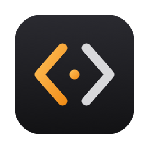
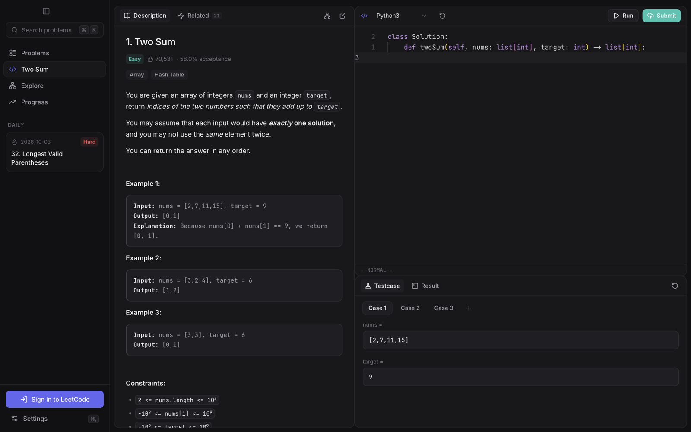
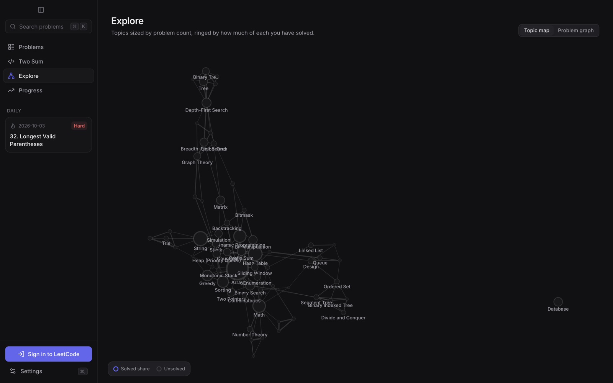
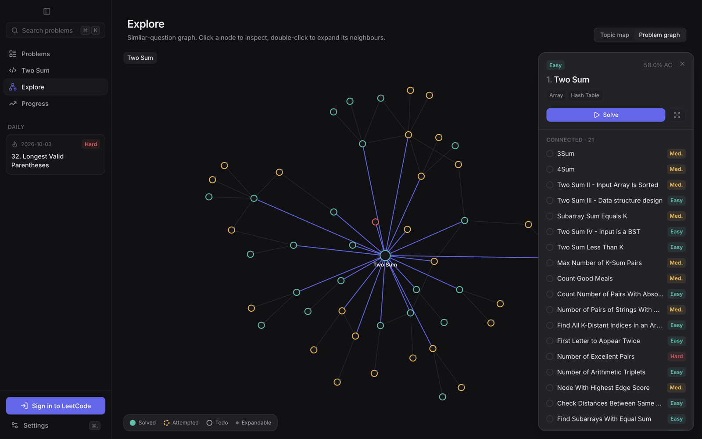
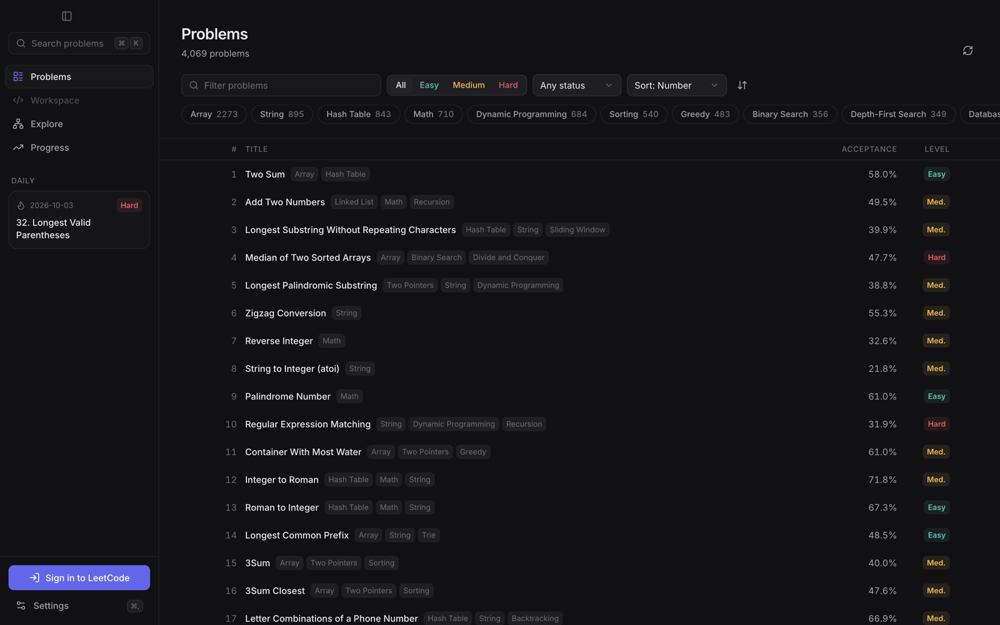

<!-- LOGO -->
<h1>
<p align="center">
  
  <br>LeetHelp
</h1>
  <p align="center">
    A fast, clean LeetCode client for macOS.
    <br />
    Read, solve, run and <i>actually submit</i> without opening a browser tab.
    <br />
    <a href="#about">About</a>
    ·
    <a href="https://github.com/joshjkns/leethelp/releases">Download</a>
    ·
    <a href="#features">Features</a>
    ·
    <a href="#shortcuts">Shortcuts</a>
    ·
    <a href="#developing">Developing</a>
  </p>
</p>

<p align="center">
  
</p>

## About

LeetHelp is a desktop app for practising on LeetCode. It talks straight to
LeetCode's own API, so the problem set, your solved status, and your
submissions are the same ones you see on the website. Runs and submissions
go through your account and count toward your profile.

It started from a few gripes with the site: it's slow, busy and full of
distractions, and it doesn't help you see how problems relate to each other.
LeetHelp aims to fix those:

- **Fast.** The problem set is cached locally and refreshed in the
  background. Search covers all ~4,000 problems as you type, and switching
  views keeps the editor mounted.
- **Clean.** It's one quiet interface built on Radix primitives, Inter and
  JetBrains Mono, with a translucent macOS sidebar.
- **Connected.** You can browse problems as a graph instead of a list.

## Features

### Workspace

The layout matches the website: description on the left, Monaco editor on
the right, test console below.

- Starter code for every language LeetCode supports, with per-problem drafts
  that autosave
- Editable test cases, one field per parameter, which you can add or remove
- **Run** against your cases and **Submit** for real, with results showing
  runtime and memory percentiles, the failing input, expected vs. actual
  output, and stdout
- Hints, similar questions, and problems that share topics

### Explore

<p align="center">
  
  
</p>

- **Topic map.** Every LeetCode tag is a node, sized by how many problems it
  has and ringed by how much of it you've solved. Edges link topics that
  often appear together. Click a topic to list its unsolved problems.
- **Problem graph.** Start from any problem and follow LeetCode's "similar
  questions". Nodes are coloured by difficulty and filled once solved.
  Double-click a node to expand it, or re-centre the graph on it, and use
  the breadcrumbs to go back.

### Problems

<p align="center">
  
</p>

A virtualised list of the whole problem set. You can filter by difficulty,
status and topic, sort by number, difficulty or acceptance, and jump to
today's daily challenge from the sidebar.

### Progress

When you're signed in, this view shows the same numbers as your profile: the
solved ring split by difficulty, "beats" percentages, streak, a year-long
submission heatmap, topic breakdowns and recent accepted submissions.

### Customisation

- Light, dark or system theme, plus 8 accent colours
- A collapsible sidebar (<kbd>⌘</kbd> <kbd>B</kbd>) and a translucent-sidebar
  toggle
- Interface scale, and an option to put the editor on the left
- Editor font, size, ligatures, tab width, **Vim mode**, relative line
  numbers, word wrap and minimap
- Default language, and options to hide Premium problems or topic tags

## Shortcuts

| Action | Keys |
| --- | --- |
| Command palette / jump to problem | <kbd>⌘</kbd> <kbd>K</kbd> |
| Run sample tests | <kbd>⌘</kbd> <kbd>'</kbd> |
| Submit | <kbd>⌘</kbd> <kbd>↵</kbd> |
| Toggle sidebar | <kbd>⌘</kbd> <kbd>B</kbd> |
| Problems · Workspace · Explore · Progress | <kbd>⌘</kbd> <kbd>1</kbd>–<kbd>4</kbd> |
| Settings | <kbd>⌘</kbd> <kbd>,</kbd> |

## Download

Get the latest `.dmg` from
[Releases](https://github.com/joshjkns/leethelp/releases) and drag LeetHelp
into Applications.

LeetHelp is signed ad-hoc but not notarised by Apple, so macOS blocks it the
first time you open it. To allow it, either:

- open it once, then go to **System Settings → Privacy & Security** and click
  **Open Anyway**, or
- run this in a terminal:

  ```sh
  xattr -dr com.apple.quarantine /Applications/LeetHelp.app
  ```

### Signing in

Click **Sign in to LeetCode** in the sidebar and log in on the normal
LeetCode page. LeetHelp picks up the session when you're done. If the
sign-in window gets blocked (some Google/GitHub SSO flows refuse embedded
browsers), open **Settings → Account** and paste your `LEETCODE_SESSION` and
`csrftoken` cookies from your browser's DevTools.

Your session stays on your Mac, in the app's own browser partition. It's
only ever sent to `leetcode.com`.

## Developing

You need Node 20+ and [pnpm](https://pnpm.io).

```sh
pnpm install
pnpm dev        # run with hot reload
pnpm build      # production build into out/
pnpm start      # run the production build
pnpm dist       # package dist/mac-arm64/LeetHelp.app (+ .dmg)
pnpm typecheck
```

**Stack:** Electron · React 19 · TypeScript · Tailwind CSS 4 · Radix UI ·
Monaco · react-force-graph · Motion · Zustand

```
src/
  main/        Electron main process + LeetCode API client (GraphQL, run/submit, cache)
  preload/     typed IPC bridge (window.api)
  shared/      types shared by both sides
  renderer/    React app: views/, components/, lib/
```

---

<p align="center"><sub>Not affiliated with LeetCode.</sub></p>
